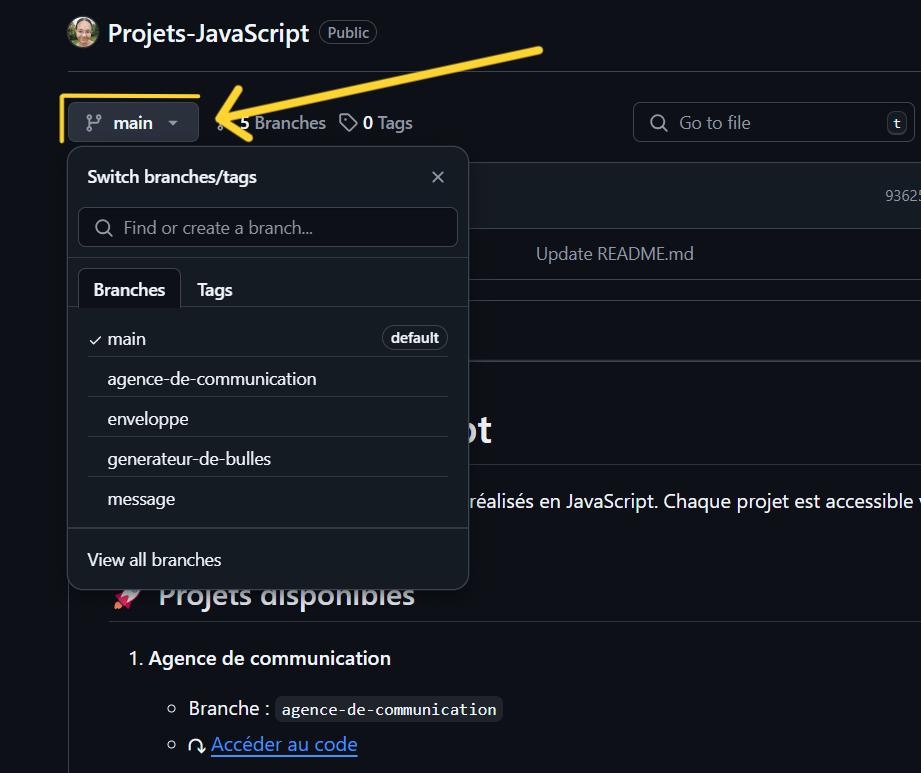

# 🗃️ Projets JavaScript

Ce repository regroupe plusieurs projets réalisés en JavaScript.
Chaque projet est accessible via une branche spécifique.

## 🚀 Projets disponibles

1. **Agence de communication**
   - Branche : `agence-de-communication`
   - ↷ [Accéder au code](https://github.com/DevJoanaBureth/Projets-JavaScript/tree/agence-de-communication)

2. **Enveloppe**
   - Branche : `enveloppe`
   - ↷ [Accéder au code](https://github.com/DevJoanaBureth/Projets-JavaScript/tree/enveloppe)

3. **Générateur de bulles**
   - Branche : `generateur-de-bulles`
   - ↷ [Accéder au code](https://github.com/DevJoanaBureth/Projets-JavaScript/tree/generateur-de-bulles)

3. **Message**
   - Branche : `message`
   - ↷ [Accéder au code](https://github.com/DevJoanaBureth/Projets-JavaScript/tree/message)
